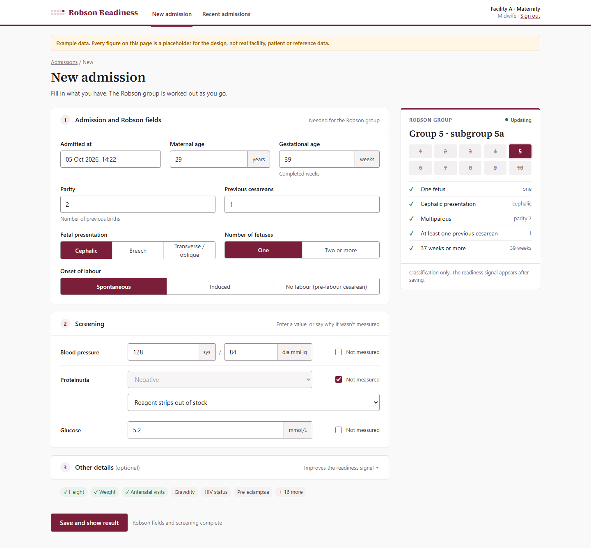
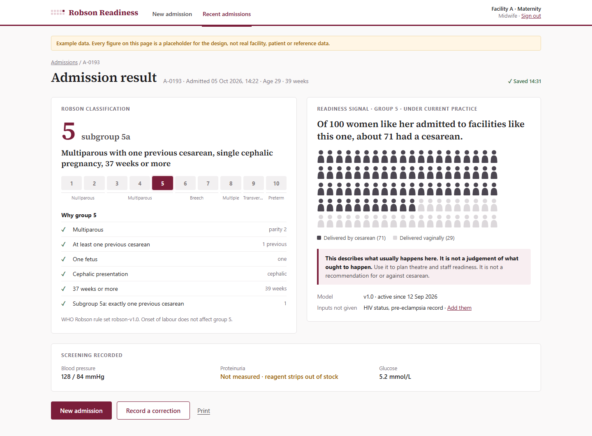
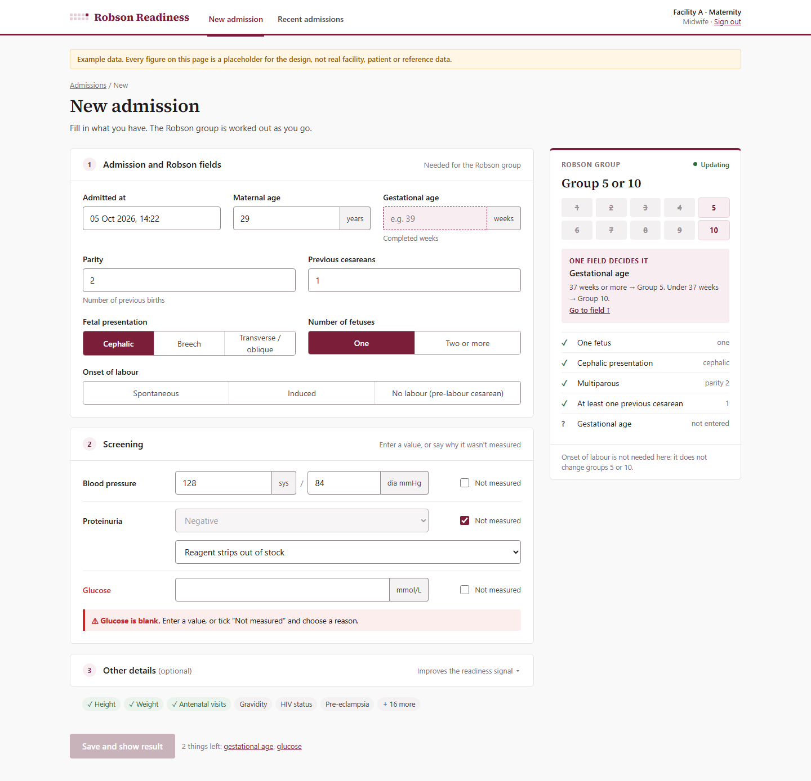
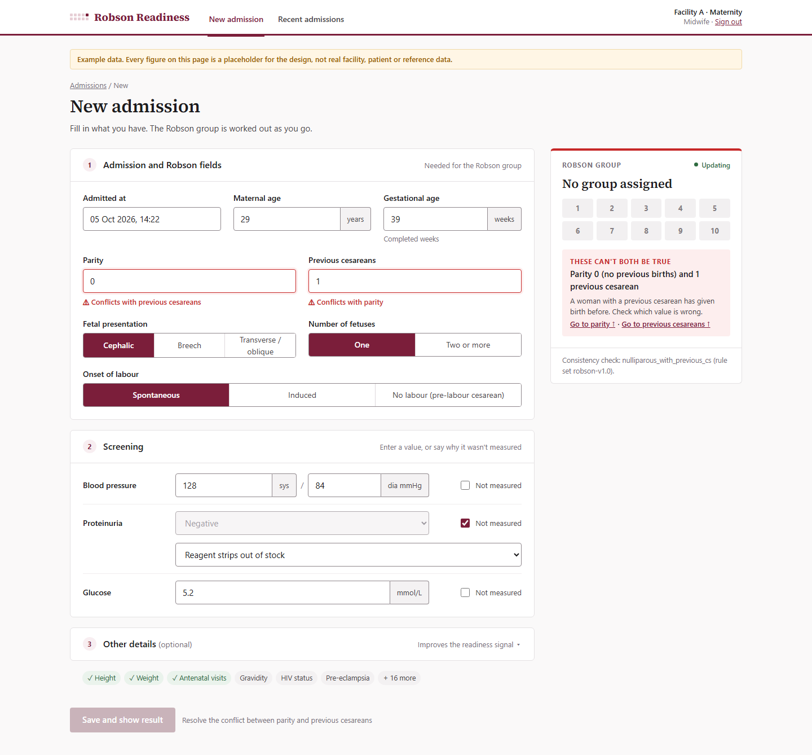
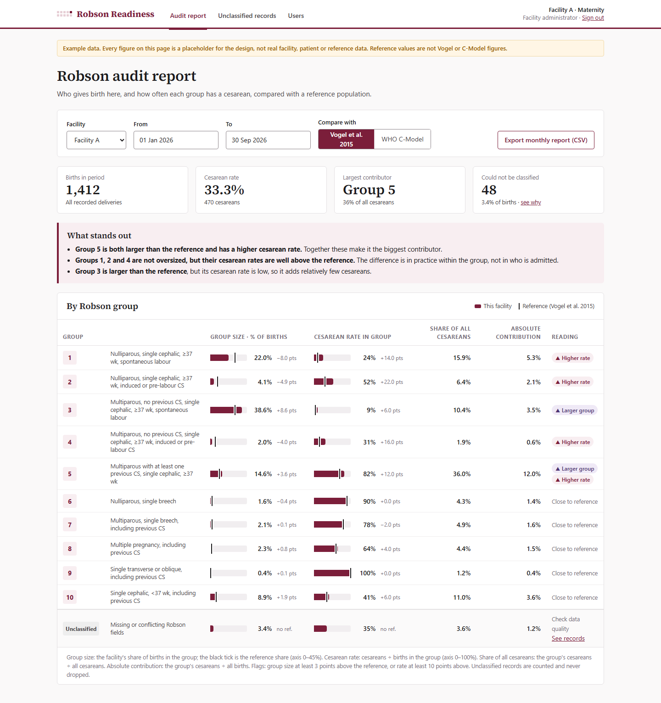
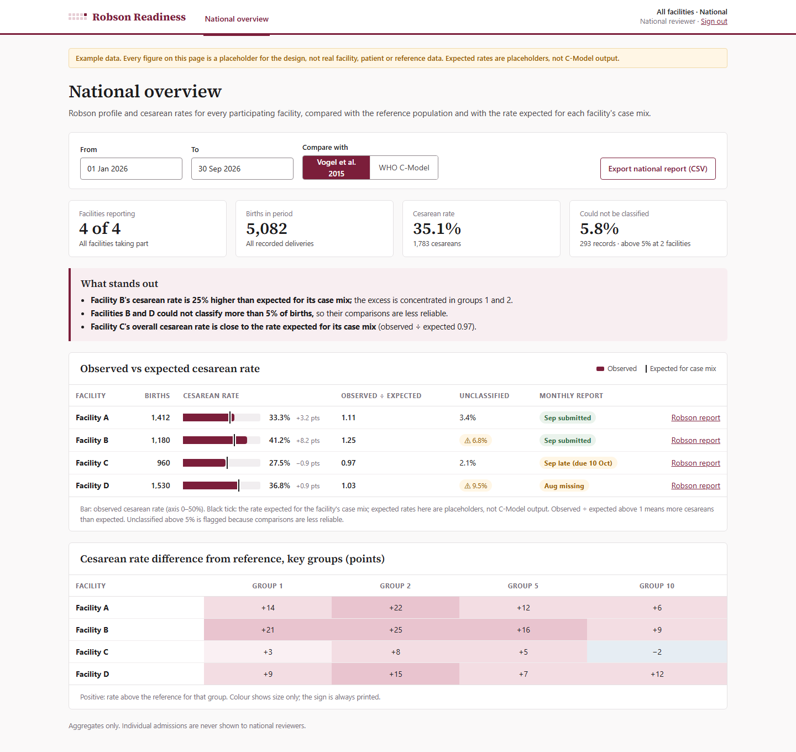
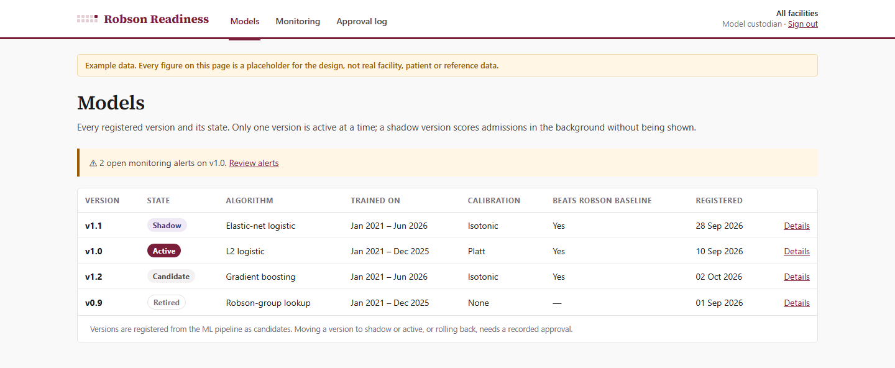
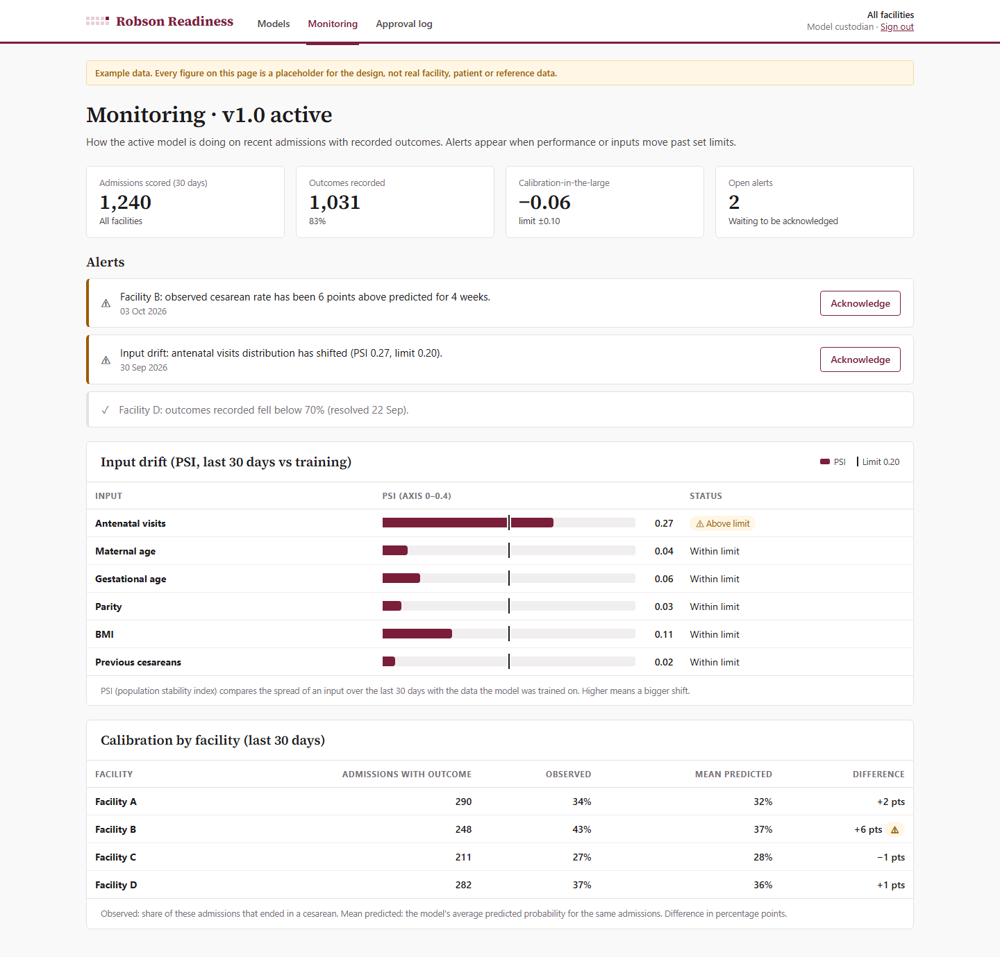

# Robson Readiness

**Automated Robson Ten-Group Classification and Cesarean Readiness System for Rwandan maternity units**

Repository: <https://github.com/icyeza/robby>
Video demo: **[link to the demo video]** <!-- replace with the YouTube / Drive link -->

## Description

At admission to a maternity ward, the system:

1. **Classifies** the woman into one of the WHO Robson Ten Groups automatically, from six admission
   fields (parity, previous cesareans, number of fetuses, presentation, gestational age, onset of
   labour). When fields are missing it lists the groups still possible and the field that would
   decide; when fields contradict each other it names them. Every result comes with the rules it
   checked.
2. **Enforces screening**: blood pressure, proteinuria and glucose must be entered, or a reason for
   not measuring them recorded.
3. **Estimates readiness**: a calibrated probability that the birth ends in a cesarean *under current
   practice*, an operational signal for theatre planning. It is never a recommendation for or
   against a cesarean.
4. **Audits facilities**: Robson group sizes, CS rates and contributions per facility, compared with
   reference populations and adjusted for case-mix.

The model was trained on 5,520 de-identified delivery records from four hospitals in and around Kigali
(Muhima, Masaka, Kibagabaga, La Croix du Sud; November 2023 to March 2024), shared under a data-sharing
agreement. The data are **not** in this repository.

### Results so far

| | |
|---|---|
| Robson classification | 94.4% of records resolve to exactly one group; no record is contradictory |
| Selected model | L2 logistic regression (feature set FS2, iterative imputation), chosen by a rule committed before training |
| Discrimination on an unseen hospital | mean AUC **0.752** (0.71-0.82 across the four hospitals), vs 0.730 for the Robson-group lookup alone |
| Calibration | slope **0.99** (target 0.8-1.2) |
| Later time period | AUC 0.772 (Robson lookup: 0.725) |
| Model families compared | 8, from a single decision tree to an FT-Transformer: all between 0.71 and 0.75 AUC |

## Repository layout

| Folder | Contents |
|---|---|
| [`ML/`](ML/) | Notebooks, ML code, tests and the API. **Start with [`ML/README.md`](ML/README.md)** |
| [`ML/notebooks/`](ML/notebooks/) | `01_cesarean_readiness_pipeline.ipynb` (data, EDA, model architectures, training, metrics, selection, interpretation) and `02_audit_and_research_questions.ipynb` (Robson audit, case-mix, missing data) |
| [`ML/api/`](ML/api/) | FastAPI service: Robson classification and readiness probability, with Swagger UI |
| [`ui-mockups/`](ui-mockups/) | Clickable HTML mockups of every screen of the web app, and their [screenshots](ui-mockups/screenshots/) |

## Setup

Prerequisites: [Git](https://git-scm.com/), [uv](https://docs.astral.sh/uv/getting-started/installation/)
(it installs Python 3.11 itself) and a web browser.

```bash
git clone https://github.com/icyeza/robby.git
cd robby/ML
uv sync                       # creates .venv with every dependency pinned in uv.lock
uv run pytest                 # test suite (runs on synthetic data)
```

**Notebooks.** Open `ML/notebooks/*.ipynb` in Jupyter (`uv run jupyter lab notebooks/`) or VS Code
using the `ML/.venv` interpreter. The committed copies already contain the real-data outputs. Without
the private dataset, re-running them uses synthetic data automatically.

**API.** From `ML/`:

```bash
uv run uvicorn api.main:app --reload
# open http://127.0.0.1:8000/docs  (Swagger UI)
```

Endpoints: `GET /health`, `GET /model`, `POST /classify` (Robson group with explanation),
`POST /admissions/assess` (screening check + Robson group + readiness probability). Details and an
example are in [`ML/README.md`](ML/README.md#serving-the-model-api).

The trained model (`ML/artefacts/readiness-v1.0/`) is not in the repository, because it was fitted on
the private data. `uv run python scripts/build_demo_model.py` builds a stand-in model from synthetic
data in about a minute; start the API with `ROBSON_MODEL_DIR=artefacts/demo-synthetic`. Without any
model the API still classifies admissions and reports that the readiness estimate is unavailable,
the same graceful degradation the app is designed for.

**UI mockups.** Open `ui-mockups/index.html` in a browser. No server or build step is needed.

## Designs

* Figma: <https://www.figma.com/design/pjOYnAzRpyY2UjmONP0gTZ/Robby>
* Clickable mockups: [`ui-mockups/index.html`](ui-mockups/index.html), 23 screens covering every role
  and the error states.

| Admission form with live Robson group | Result: group, explanation and readiness signal |
|---|---|
|  |  |
| **Incomplete inputs: the field that decides** | **Contradictory inputs** |
|  |  |
| **Facility audit report** | **National overview** |
|  |  |
| **Model registry** | **Model monitoring** |
|  |  |

Every screen:

| Area | Screens |
|---|---|
| Everyone | [Sign in](ui-mockups/screenshots/login.png) ([phone](ui-mockups/screenshots/login-mobile.png)), [session ended](ui-mockups/screenshots/session-expired.png) |
| Clinician | [new admission](ui-mockups/screenshots/admission-new.png), [incomplete](ui-mockups/screenshots/admission-incomplete.png), [conflict](ui-mockups/screenshots/admission-conflict.png), [result](ui-mockups/screenshots/result.png) ([phone](ui-mockups/screenshots/result-mobile.png)), [result without a model](ui-mockups/screenshots/result-no-model.png), [recent admissions](ui-mockups/screenshots/admissions-recent.png), [record outcome](ui-mockups/screenshots/outcome-record.png), [correction](ui-mockups/screenshots/correction.png), [corrected result](ui-mockups/screenshots/result-corrected.png), [connection lost](ui-mockups/screenshots/connection-lost.png) |
| Facility administrator / model custodian | [audit report](ui-mockups/screenshots/audit-report.png), [unclassified records](ui-mockups/screenshots/unclassified.png), [users](ui-mockups/screenshots/users.png), [models](ui-mockups/screenshots/models.png), [model detail](ui-mockups/screenshots/model-detail.png), [monitoring](ui-mockups/screenshots/monitoring.png), [approval log](ui-mockups/screenshots/audit-log.png) |
| National | [overview](ui-mockups/screenshots/national-overview.png), [facility report](ui-mockups/screenshots/national-facility.png), [facilities](ui-mockups/screenshots/facilities.png) |

## Deployment plan

**Target:** one partner maternity unit first (a pilot), on hardware the hospital already has, with
intermittent power and no dedicated systems administrator. It needs ethics clearance; until then it
runs as a demonstration instance on de-identified records.

**Architecture:** a single Python application.

```
browser (clinician, administrator) ──HTTPS──> nginx (reverse proxy, TLS)
                                                │
                                                ▼
                             Uvicorn workers under systemd: FastAPI app
                             ├── Robson rule engine (versioned rule set)
                             ├── readiness model (joblib, loaded in-process)
                             └── audit service
                                                │
                                                ▼
                                   PostgreSQL (encrypted, append-only records)
```

* **One service, no containers.** Installing or recovering it means updating one virtual environment
  (`uv sync`) and restarting one systemd unit, which a hospital IT officer can do.
* **The model runs inside the API process.** The calibrated scikit-learn pipeline is loaded with
  joblib, so there is no separate inference service to keep alive.
* **Model lifecycle.** A new model is trained offline with `robson-ml fit-deploy`, registered as a
  *candidate*, run in *shadow* (scored but not shown), and promoted to *active* only through a recorded
  approval. Exactly one model is active, and every prediction stores the model and rule-set versions
  that produced it.
* **Monitoring.** Predictions are matched to delivery outcomes once recorded, and discrimination and
  calibration are tracked on a rolling window per facility and Robson group (the monitoring screen).
* **Graceful degradation.** If the model is unavailable, the Robson classification still works. If
  the network drops, the form keeps what was entered.
* **Security.** HTTPS with token authentication, role-based access (clinician, facility
  administrator, model custodian, national), and no identifiable data leaving the facility.

**Steps:**

| Step | What | Status |
|---|---|---|
| 1 | Train, evaluate and select the model; freeze `readiness-v1.0` | Done |
| 2 | Robson engine as a tested package (`ML/packages/robson_engine`) | Done |
| 3 | API exposing classification and readiness (`ML/api`) | Done (MVP) |
| 4 | UI design (Figma and HTML mockups) | Done |
| 5 | Web app: server-rendered pages (Jinja2 + htmx) on the API, PostgreSQL storage, sign-in | Next |
| 6 | Install on a server at the partner facility (nginx + systemd), usability sessions with clinicians | After ethics clearance |
